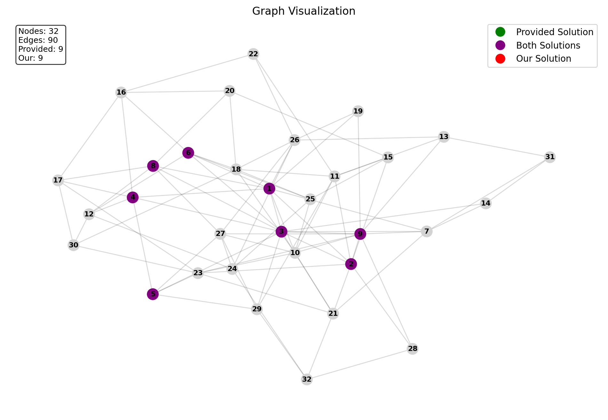
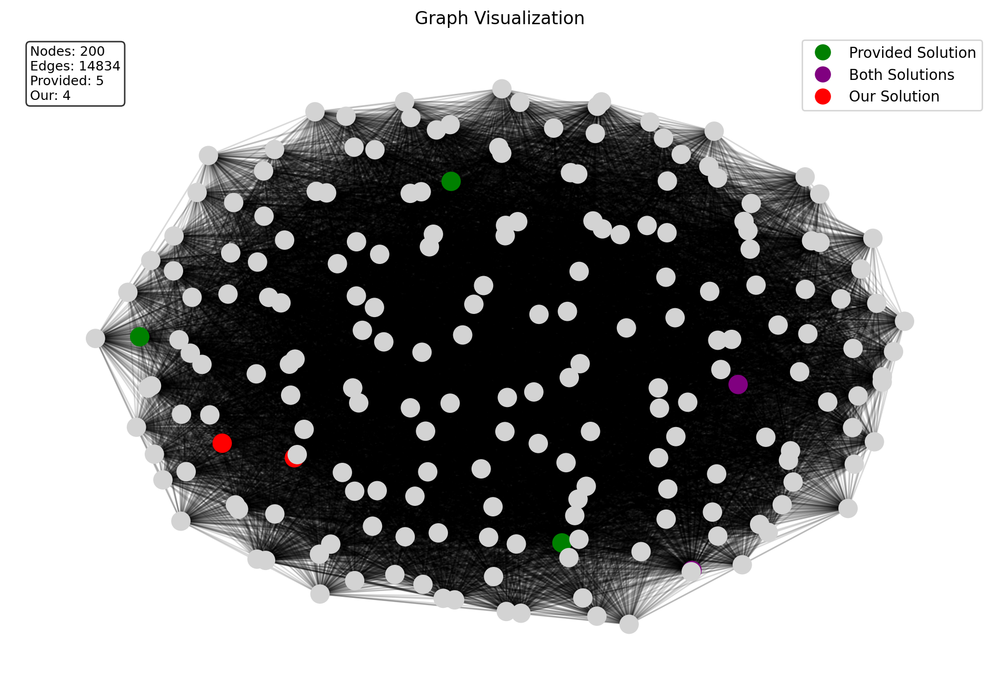

# QC_optimization_project_HS_26

This repository contains the code for the QC optimization project at the Quantum Computing Course at ZHAW HS 2025.

## Link to the source of the project

The project is based on the following `Quantum Optimization Benchmarking Library (QOBL)`:

[07-independentset](https://git.zib.de/qopt/qoblib-quantum-optimization-benchmarking-library/-/tree/main/07-independentset?ref_type=heads)

## Project Structure

- [`benchmark_timeout.py`](benchmark_timeout.py): Script to loop over all provided instances and benchmark the algorithms with a timeout.
- [`ibm_solver.py`](ibm_solver.py): Implementation of the IBM Q solver using Qiskit.
- [`ibm_solver_large.py`](ibm_solver_large.py): Implementation of the IBM Q solver for larger instances utulizing devide and conquer strategy.
- [`benchmark_stats_all.csv`](benchmark_stats_all.csv): CSV file containing the benchmark statistics for all instances.
- [`graph_visualizer.py`](graph_visualizer.py): Script to visualize the graph and the solutions.
- [`run_visualizations.sh`](run_visualizations.sh): Shell script to run visualizations for all instances.
- [`solutionstemp/`](solutionstemp/): Directory containing our solutions for the provided instances.
- [`visualizations/`](visualizations/): Directory containing the generated visualizations.

## Visualizations Examples

## Authors

- Wyss Julien
- Perret Lucien
- Zürcher Patrick
- Esposito Diego